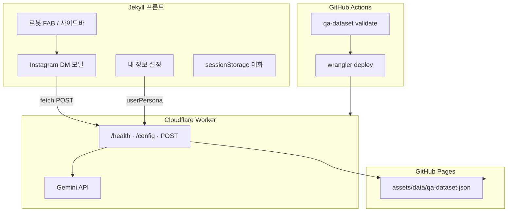

# AI Agent — 블로그 생성형 AI 챗봇 구축기

## 들어가며

처음에는 **알고리즘 문제 자동 추천**에 맞춘 챗봇(고양이 페르소나 `비사`, `problems.json` 키워드 매칭)으로 시작했다.
하지만 실제로 필요했던 것은 **ChatGPT처럼 자유롭게 대화하는 생성형 AI**였다.

그래서 2026년 8월, 챗봇을 처음부터 다시 설계했다.

- 알고리즘 전용 로직 제거 → **Gemini 생성형 AI** 전면 적용
- `problems.json` 제거 → **`qa-dataset.json`** (질문·답변 수집)
- 팝업 페이지 → **Instagram DM 스타일 모달**
- 수동 Worker 배포 → **GitHub Actions 자동 배포**
- `gemini-3.6-flash` 중단 대응 → **`gemini-3.6-flash`**

이 글은 최종 구조와 파일, 배포 방법, 트러블슈팅을 정리한다.

---

## 1. 전체 구조



| 레이어 | 역할 |
|--------|------|
| **프론트** | 모달 UI, 대화 저장, 사용자 개인 페르소나 입력 |
| **Worker** | API 키 보호, system prompt 조립, Gemini 호출 |
| **qa-dataset.json** | (선택) 운영자가 등록한 Q&A 참고 자료 |
| **GitHub Actions** | JSON 검증 + Worker 자동 배포 |

Worker URL: `https://blog-chatbot.with-joonk.workers.dev`

---

## 2. 프론트엔드 — 모달 + 로봇 FAB

### 2-1. 파일 구조

| 파일 | 설명 |
|------|------|
| `_includes/chatbot-modal.html` | 모달 HTML, 로봇 FAB |
| `assets/css/chatbot-modal.css` | Instagram DM 스타일, 잠자는/깨어나는 FAB 애니메이션 |
| `assets/js/chatbot-modal.js` | 채팅 로직, sessionStorage, API 호출 |
| `_layouts/default.html` | 모달 include, JS 로드 |

### 2-2. UI 특징

- **사이드바 하단 중앙**에 로봇 FAB 배치 (소셜 아이콘과 겹치지 않음)
- 평소 **잠든 로봇** + Zzz 물방울 → 호버 시 터지며 깨어남
- 말풍선: *"반갑습니다 무엇을 도와드릴까요?"*
- 채팅 UI: Instagram DM 스타일 (흰 배경, 회/파란 말풍선)
- **내 정보** 탭: 닉네임, 직업, 추가 정보, 메모리 토글 (ChatGPT 맞춤 설정과 유사)
- 페이지 이동해도 대화 유지 (`sessionStorage`)

### 2-3. API 호출

```javascript
const CHATBOT_API = 'https://blog-chatbot.with-joonk.workers.dev';

await fetch(CHATBOT_API, {
  method: 'POST',
  headers: { 'Content-Type': 'application/json' },
  body: JSON.stringify({
    message: text,
    history: chatHistory,
    userPersona: getUserPersonaPayload(), // localStorage 저장
  }),
});
```

환영 메시지는 `GET /config`에서 페르소나 기반으로 받아온다.

---

## 3. Cloudflare Worker (백엔드)

### 3-1. 왜 Worker인가

Gemini API 키를 브라우저에 두면 누구나 탈취할 수 있다.
Worker가 키를 secret으로 보관하고, 프론트는 Worker URL만 호출한다.

### 3-2. API 엔드포인트

| Method | Path | 설명 |
|--------|------|------|
| GET | `/health` | Worker 상태, API 키 설정 여부 |
| GET | `/config` | 봇 이름, 환영 메시지 |
| POST | `/` | `{ message, history[], userPersona? }` → Gemini 응답 |

### 3-3. Worker 소스 구조

```
worker/blog-chatbot/
├── src/
│   ├── index.js        # fetch 라우팅, Gemini 호출
│   ├── persona.js      # 봇 페르소나 (wrangler.toml vars)
│   ├── prompts.js      # system instruction 조립
│   ├── userPersona.js  # 사용자 개인 정보 블록
│   └── qaDataset.js    # qa-dataset.json fetch·포맷
├── wrangler.toml
└── package.json
```

### 3-4. system prompt 흐름

1. **봇 페르소나** (`persona.js` + `wrangler.toml` vars)
2. **사용자 개인 정보** (`userPersona` — 프론트에서 전송)
3. **Q&A 지식베이스** (`qa-dataset.json` — 있으면 참고, 없어도 OK)
4. **유사 Q&A** (질문 키워드 매칭 상위 5개)

→ Gemini `gemini-2.5-flash`에 `systemInstruction` + 대화 history 전달

### 3-5. 페르소나 설정 (`wrangler.toml`)

```toml
BOT_NAME = "채팅봇"
BOT_TONE = "친근하고 자연스러운 존댓말..."
BOT_PERSONALITY = "도움이 되고 싶어 하는 범용 AI 어시스턴트"
BOT_EXPERTISE = "일상 대화, 질문 답변, 글쓰기·아이디어, 학습·업무·창작·코딩 등"
GEMINI_MODEL = "gemini-3.6-flash"
```

---

## 4. Q&A 지식베이스 (구 problems.json 대체)

### 4-1. 왜 바꿨는가

기존 `problems.json`은 코딩테스트 포스트에서 **알고리즘·난이도 메타데이터**를 추출해 키워드 매칭하는 용도였다.
범용 생성형 AI로 전환하면서 **질문·답변 쌍을 직접 관리**하는 방식이 더 자연스럽다.

### 4-2. JSON 형식

`assets/data/qa-dataset.json`:

```json
{
  "version": 1,
  "updated_at": "2026-08-13T00:00:00+09:00",
  "items": [
    {
      "id": "qa-0001",
      "question": "너는 누구야?",
      "answer": "저는 이 사이트의 AI 채팅봇입니다...",
      "tags": ["소개"],
      "source": "manual",
      "created_at": "2026-08-13T00:00:00+09:00"
    }
  ]
}
```

### 4-3. Python 관리 스크립트

```bash
py -3 scripts/manage_qa_dataset.py init
py -3 scripts/manage_qa_dataset.py add -q "질문" -a "답변" --tags 태그1,태그2
py -3 scripts/manage_qa_dataset.py list
py -3 scripts/manage_qa_dataset.py validate
py -3 scripts/manage_qa_dataset.py import data/new-qa.json
```

**삭제된 것:**
- `assets/data/problems.json`
- `scripts/generate_problems_json.py`
- `worker/blog-chatbot/src/problems.js`
- `.github/workflows/sync-problems-json.yml`

---

## 5. GitHub Actions 자동 배포

로컬에서 `wrangler deploy` 없이 **`main` push만으로 Worker 배포**.

워크플로: `.github/workflows/deploy-blog-chatbot.yml`

**트리거 경로:**
- `worker/blog-chatbot/**`
- `assets/data/qa-dataset.json`
- `scripts/manage_qa_dataset.py`

**Jobs:**
1. `validate` — `manage_qa_dataset.py validate`
2. `deploy` — `wrangler-action`으로 Cloudflare 배포 + `/health` 검증

### GitHub Secrets (Repository → Settings → Secrets)

| Secret | 설명 |
|--------|------|
| `CLOUDFLARE_API_TOKEN` | Cloudflare API 토큰 (Workers Edit) |
| `CLOUDFLARE_ACCOUNT_ID` | Cloudflare Account ID |
| `GEMINI_API_KEY` | Google AI Studio API 키 |

push 후 Actions 탭에서 `Deploy blog-chatbot Worker` 실행 결과를 확인한다.

---

## 6. 트러블슈팅

### ❌ Worker 500 — `gemini-2.0-flash is no longer available`

Google이 `gemini-2.0-flash`를 **2026년 6월 1일 종료**했다.
`/health`는 `hasApiKey: true`인데 채팅만 500이면 모델 문제일 가능성이 높다.

**해결:** `wrangler.toml`의 `GEMINI_MODEL`을 `gemini-3.6-flash`로 변경 후 재배포.

### ❌ CORS / 모달이 안 뜸

Chirpy 테마의 `#main-wrapper` `transform` 때문에 모달을 `<body>` 직속 자식으로 두고,
JS는 `</body>` 직전에 로드한다.

### ❌ 말풍선이 호버해도 안 뜸

예전에 `is-dismissed` + `sessionStorage`로 말풍선을 영구 숨기던 로직이 원인이었다.
제거 후 CSS `:hover` 폴백 추가로 해결.

### ❌ `ERR_NAME_NOT_RESOLVED`

챗봇 API와 별개로, 음악 MP3 등 **외부 리소스 DNS 실패**일 수 있다.
DevTools Network 탭에서 빨간 URL을 확인한다.

---

## 7. 파일 맵 (최종)

```
joonk2.github.io/
├── _includes/chatbot-modal.html
├── assets/
│   ├── css/chatbot-modal.css
│   ├── js/chatbot-modal.js
│   └── data/qa-dataset.json
├── scripts/manage_qa_dataset.py
├── worker/blog-chatbot/
│   ├── src/index.js
│   ├── src/persona.js
│   ├── src/prompts.js
│   ├── src/userPersona.js
│   ├── src/qaDataset.js
│   └── wrangler.toml
└── .github/workflows/deploy-blog-chatbot.yml
```

---

## 마치며

| 구분 | v1 (2026-05) | v2 (2026-08) |
|------|-------------|-------------|
| 성격 | 알고리즘 특화 + 고양이 페르소나 | **범용 생성형 AI** |
| 데이터 | `problems.json` (포스트 스캔) | **`qa-dataset.json`** (Q&A 직접 관리) |
| UI | 별도 페이지 / 팝업 | **Instagram DM 모달** + 로봇 FAB |
| 맞춤 설정 | 없음 | **내 정보** (닉네임·직업·메모리) |
| 배포 | 수동 `wrangler deploy` | **GitHub Actions 자동 배포** |
| 모델 | gemini-2.0-flash | **gemini-3.6-flash** |

앞으로 Q&A를 `manage_qa_dataset.py add`로 쌓고, `main`에 push하면 Worker까지 자동 반영된다.
로컬 Jekyll(`127.0.0.1:4000`)에서 챗봇을 열어 대화를 테스트해 보면 된다.
